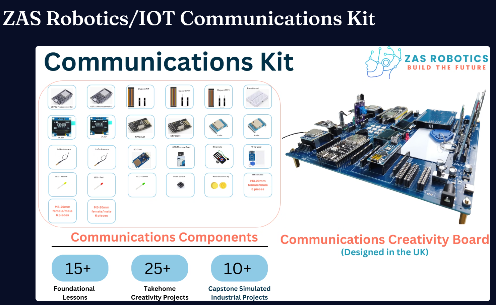

# ZAS Robotics IoT Communication Kit

## About This Repository

This repository contains the **Foundation Projects** for the  
**ZAS Robotics IoT Communication Kit**, designed to teach students and beginners:

- Wireless communication basics  
- Long-range LoRa communication (SX1278)  
- Short-range 2.4 GHz communication using NRF24L01  
- ESP32-based IoT control and data exchange  
- I2C and SPI communication with small peripherals  
- OLED-based data display  
- Introductory IoT project building  

The kit is built around the **ESP32-WROOM-32**, providing WiFi, Bluetooth, and rich GPIO access for communication-centric learning.

### You Will Learn:

- How devices communicate wirelessly  
- How data packets are transmitted and received  
- How to control and monitor systems remotely  
- How to build simple IoT applications end-to-end  
- How to interface displays and external modules over I2C/SPI  

### Suitable For:

- Students  
- Engineering beginners  
- IoT & communication learners  
- STEM education labs  

Kickstart your wireless and IoT learning with simple, progressive hands-on projects
